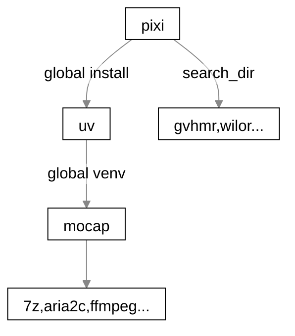

# mocap-wrapper 动捕套壳
Use with: [mocap_importer](https://github.com/AClon314/mocap_importer_blender)

Wrapping code repositories of various motion capture papers & researches, to provide a unified interface through CLI. Simplify their installation and running.  
Only tested on Linux. Not stable yet.

sincerelly thanks to gvhmr/wilor/wilor-mini developers and others that help each other♥️

## WIP 进展

> [!CAUTION]
> Currently broken! Code refactoring....
> TODO code refactor in v0.2.1:
> - MCP standard support: json-rpc
> - use `pixi` and `uv` instead of `mamba`
>   - simplify by override toml: https://github.com/prefix-dev/pixi/issues/3890
> - test case and CI, to make the installation process hardly failed.
> - wilor continuous predict.
pixi config set --local run-post-link-scripts insecure

> [!WARNING]
> There's a huge code refactoring in the up-comming release v0.2.1. The run part in v0.2.0 should be ok, see [issue#2](https://github.com/AClon314/mocap-wrapper/issues/2)
> 即将发布的 v0.2.1 版本中将进行大规模代码重构，v0.2.0的运行部分应该没有问题，请参阅 [#2](https://github.com/AClon314/mocap-wrapper/issues/2)

| Feature 功能      |                |
| ----------------- | -------------- |
| ✅ Done            | GVHMR, WiLoR   |
| 🚀 国内镜像加速    | 🚧              |
| 🐧Linux            | 🚧 Implementing |
| 🪟Windows          | ❓ Need tested  |
| 🍎 OSX             | ❓              |
| 📔Jupyter Notebook | ❓              |
| 🤖 MCP             | 🕒 TODO         |


## solutions 方案
<details><summary>
stage-by-stage scheme
</summary>

For budget, you can start with a cheap scheme and then upgrade to a more expensive one.

interactable virtual scene & record video & post-calculate → realtime calculate with better GPU → realtime with hardware support

> GPU → iphone → quest3

|                 | minimum                                                 | medium                                                  | higher                                            |
| --------------- | ------------------------------------------------------- | ------------------------------------------------------- | ------------------------------------------------- |
| ♿🖥sit           | 🖱⌨️🎮`user input` as **body** motion/**interact** in game | `GPU`(**face+hand**) +`cam`📷                            | UE live link(**face**) +`mini tripod`🔭            |
| sit cost        | $0 game like VRchat                                     | ≥$200 GPU; $0 if use phone as cam                       | $0 live link app; ≥$350 iphone; $1 mini tripod    |
| 🧍‍♂️🎣stand         | `tripod cam`🔭+ `GPU`(**body+hand**)                     | UE live link(**face**) +Headrig                         | `UE vcam` to **interact**                         |
| stand cost $520 | $20 tripod; ≥$200 GPU                                   | $0 live link app; $300 rokoko headrig                   | $0 vcam app                                       |
| 👓VR             | `quest3` realtime **hand** mocap & natural **interact** | ~~quest4~~ or `pico 4 pro` or DIY hardware for **face** | `tracker` hardware or `GPU` software for **body** |
| VR cost $850    | $400                                                    | ?                                                       | $450 tracker or ≥$200 GPU                         |

</details>

### software:OpenSource
Rank: [body🕺](https://paperswithcode.com/task/3d-human-pose-estimation "3D人体姿态估计")  [hand👋](https://paperswithcode.com/task/3d-hand-pose-estimation "3D手部姿态估计")  [face👤](https://paperswithcode.com/task/facial-landmark-detection "面部特征点检测") [text to motion文](https://paperswithcode.com/task/motion-synthesis "运动合成(文→动作)")

| model                                                                                                                                                                                                                       | paper                                                                                                                                    | commit                                                                                                                                                                                                                                                            | issue                                                                                                                                                                                                                                          | comment                                                                      |
| --------------------------------------------------------------------------------------------------------------------------------------------------------------------------------------------------------------------------- | ---------------------------------------------------------------------------------------------------------------------------------------- | ----------------------------------------------------------------------------------------------------------------------------------------------------------------------------------------------------------------------------------------------------------------- | ---------------------------------------------------------------------------------------------------------------------------------------------------------------------------------------------------------------------------------------------- | ---------------------------------------------------------------------------- |
| [✅🕺GVHMR ](https://github.com/zju3dv/GVHMR "World-Grounded Human Motion Recovery via Gravity-View Coordinates")                                    | [](https://doi.org/10.1145/3680528.3687565)           | [ ](https://github.com/zju3dv/GVHMR/commits)                                                          | [ ](https://github.com/zju3dv/GVHMR/issues)                                                          | 2024, VRAM > 3GB                                                             |
| [🚧🕺TRAM ](https://github.com/yufu-wang/tram "Global Trajectory and Motion of 3D Humans from in-the-wild Videos")                                 | [](https://doi.org/10.1007/978-3-031-73247-8_27) | [ ](https://github.com/yufu-wang/tram/commits)                                                    | [ ](https://github.com/yufu-wang/tram/issues)                                                    | 2024, suit for fast-motion, but VRAM > 6GB                                   |
| [🕒🕺CoMotion ](https://github.com/apple/ml-comotion "Concurrent Multi-person 3D Motion")                                                       | [](https://doi.org/10.48550/arXiv.2504.12186)       | [ ](https://github.com/apple/ml-comotion/commits)                                           | [ ](https://github.com/apple/ml-comotion/issues)                                           | 2025, belongs to Apple                                                       |
| [🕒🕺SAT-HMR ](https://github.com/ChiSu001/SAT-HMR "Real-Time Multi-Person 3D Mesh Estimation via Scale-Adaptive Tokens")                        | [](https://doi.org/10.48550/arXiv.2411.19824)       | [ ](https://github.com/ChiSu001/SAT-HMR/commits)                                              | [ ](https://github.com/ChiSu001/SAT-HMR/issues)                                              | 2025                                                                         |
| [✅👋WiLoR ](https://github.com/rolpotamias/WiLoR "End-to-end 3D hand localization and reconstruction in-the-wild")                             | [](https://doi.org/10.48550/arXiv.2409.12259)       | [ ](https://github.com/rolpotamias/WiLoR/commits)                                           | [ ](https://github.com/rolpotamias/WiLoR/issues)                                           | 2024, use [mini](https://github.com/warmshao/WiLoR-mini), fast, VRAM > 2.5GB |
| [🚧👋Dyn-HaMR ](https://github.com/ZhengdiYu/Dyn-HaMR "Recovering 4D Interacting Hand Motion from a Dynamic Camera")                           | [](https://doi.org/10.48550/arXiv.2412.12861)       | [ ](https://github.com/ZhengdiYu/Dyn-HaMR/commits)                                        | [ ](https://github.com/ZhengdiYu/Dyn-HaMR/issues)                                        | 2025                                                                         |
| [🕒👋Hamba ](https://github.com/humansensinglab/Hamba "Single-view 3D Hand Reconstruction withGraph-guided Bi-Scanning Mamba")              | [](https://doi.org/10.48550/arXiv.2407.09646)       | [ ](https://github.com/humansensinglab/Hamba/commits)                               | [ ](https://github.com/humansensinglab/Hamba/issues)                               | 2025                                                                         |
| [🕒👋OmniHands ](https://github.com/LinDixuan/OmniHands)                                                                                      | [](https://doi.org/10.48550/arXiv.2405.20330)       | [ ](https://github.com/LinDixuan/OmniHands/commits)                                     | [ ](https://github.com/LinDixuan/OmniHands/issues)                                     | 2024                                                                         |
| [🕒👋HaMeR ](https://github.com/geopavlakos/hamer "Hand Mesh Recovery")                                                                         | [](https://doi.org/10.48550/arXiv.2312.05251)       | [ ](https://github.com/geopavlakos/hamer/commits)                                           | [ ](https://github.com/geopavlakos/hamer/issues)                                           | 2023                                                                         |
| [🕒👋HOISDF ](https://github.com/amathislab/hoisdf "Constraining 3D Hand-Object Pose Estimation with Global Signed Distance Fields")            | [](https://doi.org/10.1109/CVPR52733.2024.00989) | [ ](https://github.com/amathislab/hoisdf/commits)                                           | [ ](https://github.com/amathislab/hoisdf/issues)                                           | 2024, better on occulusion                                                   |
| [🕒👤SPIGA ](https://github.com/andresprados/SPIGA "Shape Preserving Facial Landmarks with Graph Attention Networks")                          | [](https://doi.org/10.48550/arXiv.2210.07233)       | [ ](https://github.com/andresprados/SPIGA/commits)                                        | [ ](https://github.com/andresprados/SPIGA/issues)                                        | 2022                                                                         |
| [🕒👤mediapipe ](https://github.com/google-ai-edge/mediapipe "Cross-platform, customizable ML solutions for live and streaming media. ") | [](https://doi.org/10.48550/arXiv.2006.10204)       | [ ](https://github.com/google-ai-edge/mediapipe/commits)                  | [ ](https://github.com/google-ai-edge/mediapipe/issues)                      | realtime                                                                     |
| [🕒文🎵 MotionAnything ](https://github.com/steve-zeyu-zhang/MotionAnything)                                                      | [](https://doi.org/10.48550/arXiv.2503.06955)       | [ ](https://github.com/steve-zeyu-zhang/MotionAnything/commits) | [ ](https://github.com/steve-zeyu-zhang/MotionAnything/issues) | 2025, waiting code release                                                   |
| [🕒文 momask-codes ](https://github.com/EricGuo5513/momask-codes)                                                                       | [](https://doi.org/10.48550/arXiv.2312.00063)       | [ ](https://github.com/EricGuo5513/momask-codes/commits)                      | [ ](https://github.com/EricGuo5513/momask-codes/issues)                      | 2024                                                                         |
- hand: no constant tracking for video(just no yolo, ready for photo but not video)

### software:non-OpenSource
- [🕺👋👤-文🎵 Genmo （Nvidia Lab）](https://research.nvidia.com/labs/dair/genmo/)
- [🕺👋👤Look Ma, no markers: holistic performance capture without the hassle](https://www.youtube.com/watch?v=4RkLDW3GmdY)
- [👤D-ViT](https://arxiv.org/abs/2411.07167v1 "Cascaded Dual Vision Transformer for Accurate Facial Landmark Detection")

### hardware:RealTime
|           | Solution                                                                                                                                                                           | Comment       |
| --------- | ---------------------------------------------------------------------------------------------------------------------------------------------------------------------------------- | ------------- |
| 👤face     | [🍎iFacialMocap](https://www.ifacialmocap.com/) (iPhone X + PC(win/Mac)) <br> [🤖Meowface](https://suvidriel.itch.io/meowface) (free, Android, can work with iFacialMocap PC client) | Shape key     |
|           | [🍎+💻Unreal Live Link](https://dev.epicgames.com/documentation/en-us/unreal-engine/live-link-in-unreal-engine)                                                                      | Bone          |
| hand/body | VR headset or VR trackers                                                                                                                                                          | ~~Off topic~~ |
- *🍎`iphone≥X(12/13 best)`for **better face mocap result** on UE live link, though you can use android🤖 to do live link.*

## install 安装
The scripts will smartly skip or update `pixi,uv,mocap-wrapper,7z,aria2c,ffmpeg,git` if they're installed or in system $PATH.

```sh
# sudo -i; bash <(curl -sSL https://gitee.com/SuperManito/LinuxMirrors/raw/main/ChangeMirrors.sh) # 一键设置linux镜像(可选)
curl https://raw.githubusercontent.com/AClon314/mocap-wrapper/refs/heads/master/src/mocap_wrapper/install/pixi.py | python -- -y
mocap --install -b gvhmr,wilor
```

The python scripts are equivalent to the following:
```bash
#!/bin/bash -eou pipefail
# 1. pixi.py: use system python
curl -fsSL https://pixi.sh/install.sh | sh
pixi global install uv
uv python install
~/.pixi/bin/uv pip install git+https://github.com/AClon314/mocap-wrapper

# 2. mocap --install -b ''
sudo apt install 7z aria2 ffmpeg git # pixi global install 7z aria2 ffmpeg git
git clone https://github.com/zju3dv/GVHMR
aria2c hmr4d.ckpt   # download pre-trained

# 3. mocap-wrapper in uv; gvhmr/wilor... in pixi env seperately
. ~/.venv/bin/activate
mocap -i input.mp4 -b gvhmr
cd $SEARCH_DIR/GVHMR
pixi run run/gvhmr.py
```



## usage 用法
See `mocap -h` for more options.
```sh
mocap -i input.mp4
mocap -i input.mp4 -b gvhmr,wilor -o outdir
```

### [data_viewer.ipynb](tests/data_viewer.ipynb)

A useful data visualize tool to expand .pt/.npy/.npz


## dev 开发
You have to read these if you want to modify code.

```sh
LOG=debug mocap -I
```

### [docker](docker/Dockerfile)
```sh
# docker build -t mocap -f docker/Dockerfile .
podman build -t mocap -f docker/Dockerfile . --security-opt label=disable
# github action local
act -j test -v --action-offline-mode --bind --reuse --env LOG=D # --rm=false
```

### .npz struct
key: `Armature mapping from`;`Algorithm run`;`who`;`begin`;`prop[0]`;`prop[1]`...

example: 
- smplx;gvhmr;person0;0;body_pose = array([...], dtype=...)
- smplx;wilor;person1;9;hand_pose = ...
- smplx;wilor;person1;1;bbox = ...

ps: the blender addon use *Armature mapping **to***

#### prop[0]
- pose: thetas, θ
- betas: shape, β
- expression: psi, ψ
- trans(lation) 平移
- global_orient: rotate 旋转
- bbox: yolo_bbox_xyXY

## Licenses 协议
By using this repository, you must also comply with the terms of these external licenses:

| Repo          | License                                                                                                                                                                                                                                              |
| ------------- | ---------------------------------------------------------------------------------------------------------------------------------------------------------------------------------------------------------------------------------------------------- |
| GVHMR         | [Copyright 2022-2023 3D Vision Group at the State Key Lab of CAD&CG, Zhejiang University. All Rights Reserved. ](https://github.com/zju3dv/GVHMR/blob/main/LICENSE "CC BY-NC-SA") |
| WiLoR         | [](https://github.com/rolpotamias/WiLoR/blob/main/license.txt "CC BY-NC-ND 4.0")                                                                                              |
| mocap-wrapper | [AGPL v3](./LICENSE)                                                                                                                                                                                                                                 |